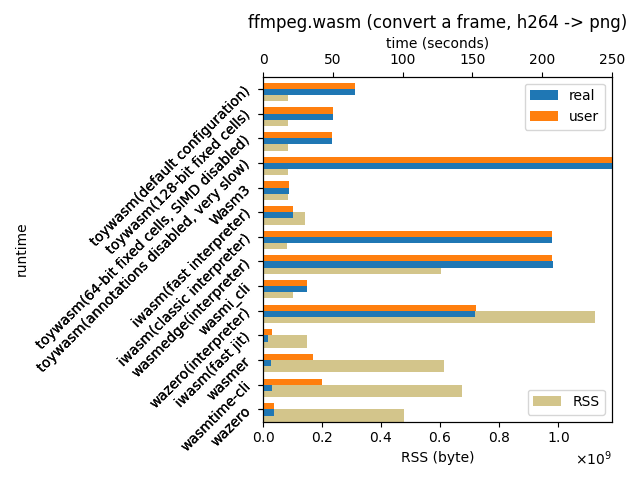

# A benchmark with ffmpeg

## What's this

[A simple benchmark with ffmpeg](./benchmark/ffmpeg.sh), intended to
measure computation performance with a real application.

For each runtimes, it converts a video frame with `ffmpeg.wasm` and
measures the time taken.

## Result



* Run on a macOS/amd64 laptop:

  ```
  MacBook Pro (15-inch, 2018)
  2.2 GHz 6-Core Intel Core i7
  ```

* [Raw values](./ffmpeg.txt)

* Plotted with [tocsv-ffmpeg.awk](./tocsv-ffmpeg.awk) and
  [plot-ffmpeg.py](./plot-ffmpeg.py).

## Observations

* toywasm performs reasonably well for an interpreter.
  It's slower than the fastest interpreters though.

* toywasm with annotations disabled is very slow.

* toywasm's memory consumption is reasonable as well.
  (See "maximum resident set size" and "peak memory footprint".
  I don't know what exactly these metrics reported by macOS's time(1)
  mean though. Also, for some reasons, these numbers seem a bit unstable
  and vary among runs. If you know better metrics to show memory footprint,
  preferably available on macOS, please let us know.)

* toywasm is far slower than JIT-based engines as expected.

* Many of JIT-based engines use multiple threads to hide its
  compilation time. (You can see their "user" time is often longer
  than "real" because of this.)
