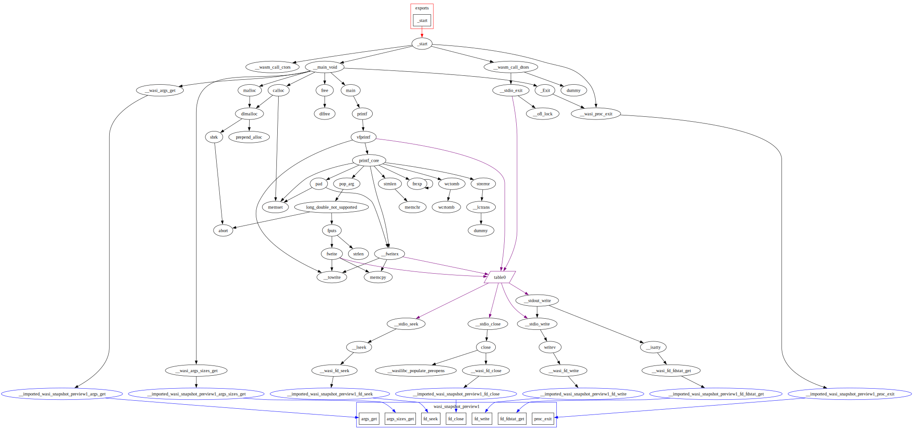

# What's this

A sample program to print the function callgraph of the given module in
the graphviz format.

# Example

The graph of a typical WASI hello world program.

```c
#include <stdio.h>

int
main(int argc, char **argv)
{
        printf("hello\n");
}
```

```shell
% /opt/wasi-sdk-22.0/bin/clang a.c
% callgraph a.out > a.gv
dot -Tsvg -o hello.svg a.gv
```


